# SecureConnect — Express.js vs Node.js Usage & Working Diagram

## Express.js vs Node.js: Where Each Is Used

Express.js is a **framework built on top of Node.js**. In SecureConnect, they serve distinct roles. Here's a clean separation:

---

### 🟢 Pure Node.js (No Express)

These files use **only Node.js core modules** or npm packages that are unrelated to Express. Express is never imported or used.

| File | What It Does | Node.js APIs / Packages Used |
|------|-------------|------------------------------|
| [env.js](file:///c:/Users/ronro/OneDrive/Documents/py-pro/SecureConnect/src/config/env.js) | Loads environment variables | `dotenv`, `process.env`, `process.exit` |
| [db.js](file:///c:/Users/ronro/OneDrive/Documents/py-pro/SecureConnect/src/config/db.js) | Initializes Sequelize/SQLite DB, seeds admin | `bcryptjs`, `sequelize`, `console` |
| [models/index.js](file:///c:/Users/ronro/OneDrive/Documents/py-pro/SecureConnect/src/models/index.js) | Defines Sequelize models & associations | `sequelize` ORM |
| [User.js](file:///c:/Users/ronro/OneDrive/Documents/py-pro/SecureConnect/src/models/User.js), [Message.js](file:///c:/Users/ronro/OneDrive/Documents/py-pro/SecureConnect/src/models/Message.js), [Group.js](file:///c:/Users/ronro/OneDrive/Documents/py-pro/SecureConnect/src/models/Group.js), etc. | Individual Sequelize model definitions | `sequelize` DataTypes |
| [socketManager.js](file:///c:/Users/ronro/OneDrive/Documents/py-pro/SecureConnect/src/sockets/socketManager.js) | Manages Socket.IO connections, JWT auth for WS | `socket.io`, `jsonwebtoken`, `redis` |
| [chatEvents.js](file:///c:/Users/ronro/OneDrive/Documents/py-pro/SecureConnect/src/sockets/events/chatEvents.js) | Handles `send-message` socket event | Sequelize `Message.create()` |
| [webrtcEvents.js](file:///c:/Users/ronro/OneDrive/Documents/py-pro/SecureConnect/src/sockets/events/webrtcEvents.js) | WebRTC signaling (call/answer/ICE) | Socket.IO events only |
| [groupEvents.js](file:///c:/Users/ronro/OneDrive/Documents/py-pro/SecureConnect/src/sockets/events/groupEvents.js) | Group chat/call socket events | Socket.IO + Sequelize |
| [creditHelper.js](file:///c:/Users/ronro/OneDrive/Documents/py-pro/SecureConnect/src/sockets/utils/creditHelper.js) | Credit deduction logic | Sequelize `User` model |
| [asyncHandler.js](file:///c:/Users/ronro/OneDrive/Documents/py-pro/SecureConnect/src/middleware/asyncHandler.js) | Generic async error wrapper | Pure JS (wraps promises) |
| **All frontend JS** (`public/js/*`) | Client-side browser code | Browser APIs (`fetch`, `localStorage`, `io()`) |

---

### 🔵 Express.js (The HTTP Framework Layer)

These files **import or depend on `express`** — they define routes, use `express.Router()`, or use Express middleware APIs (`req`, `res`, `next`).

| File | What It Does | Express APIs Used |
|------|-------------|-------------------|
| [server.js](file:///c:/Users/ronro/OneDrive/Documents/py-pro/SecureConnect/server.js) | **Main entry point** — creates Express app, mounts middleware & routes, starts HTTP server | `express()`, `app.use()`, `app.get()`, `express.json()`, `express.static()`, `http.createServer(app)` |
| [authRoutes.js](file:///c:/Users/ronro/OneDrive/Documents/py-pro/SecureConnect/src/routes/authRoutes.js) | Auth endpoints (`/register`, `/login`, `/logout`) | `express.Router()`, `router.post()` |
| [userRoutes.js](file:///c:/Users/ronro/OneDrive/Documents/py-pro/SecureConnect/src/routes/userRoutes.js) | User profile & key endpoints | `express.Router()`, `router.get/post()` |
| [messageRoutes.js](file:///c:/Users/ronro/OneDrive/Documents/py-pro/SecureConnect/src/routes/messageRoutes.js) | Message history endpoints | `express.Router()`, `router.get()` |
| [creditRoutes.js](file:///c:/Users/ronro/OneDrive/Documents/py-pro/SecureConnect/src/routes/creditRoutes.js) | Credit balance/purchase endpoints | `express.Router()` |
| [adminRoutes.js](file:///c:/Users/ronro/OneDrive/Documents/py-pro/SecureConnect/src/routes/adminRoutes.js) | Admin dashboard endpoints | `express.Router()`, `requireAdmin` middleware |
| [groupRoutes.js](file:///c:/Users/ronro/OneDrive/Documents/py-pro/SecureConnect/src/routes/groupRoutes.js) | Group CRUD endpoints | `express.Router()` |
| [authController.js](file:///c:/Users/ronro/OneDrive/Documents/py-pro/SecureConnect/src/controllers/authController.js) | Register/login/logout handlers | `(req, res)` Express handler functions |
| [userController.js](file:///c:/Users/ronro/OneDrive/Documents/py-pro/SecureConnect/src/controllers/userController.js) | User profile handlers | `(req, res)` |
| [messageController.js](file:///c:/Users/ronro/OneDrive/Documents/py-pro/SecureConnect/src/controllers/messageController.js) | Message retrieval handlers | `(req, res)` |
| [creditController.js](file:///c:/Users/ronro/OneDrive/Documents/py-pro/SecureConnect/src/controllers/creditController.js) | Credit logic handlers | `(req, res)` |
| [adminController.js](file:///c:/Users/ronro/OneDrive/Documents/py-pro/SecureConnect/src/controllers/adminController.js) | Admin actions (ban, delete, stats) | `(req, res)` |
| [groupController.js](file:///c:/Users/ronro/OneDrive/Documents/py-pro/SecureConnect/src/controllers/groupController.js) | Group CRUD handlers | `(req, res)` |
| [auth.js](file:///c:/Users/ronro/OneDrive/Documents/py-pro/SecureConnect/src/middleware/auth.js) | JWT authentication middleware | `(req, res, next)` Express middleware |
| [rateLimit.js](file:///c:/Users/ronro/OneDrive/Documents/py-pro/SecureConnect/src/middleware/rateLimit.js) | Rate limiting middleware | `express-rate-limit` (Express middleware) |
| [errorHandler.js](file:///c:/Users/ronro/OneDrive/Documents/py-pro/SecureConnect/src/middleware/errorHandler.js) | Global error handler | `(err, req, res, next)` Express error middleware |
| [upload.js](file:///c:/Users/ronro/OneDrive/Documents/py-pro/SecureConnect/src/config/upload.js) | File upload config | `multer` (Express middleware) |

---

### 🟡 Key Distinction Summary

> [!IMPORTANT]
> **Node.js** is the runtime — it powers everything. **Express.js** is only used for the **HTTP request/response cycle** (routes, middleware, serving pages). **Socket.IO**, **Sequelize**, **JWT**, and the **frontend code** all run on Node.js but do NOT use Express.

---

## Complete Working Diagram

### How a Request Flows Through the System

```mermaid
sequenceDiagram
    participant B as Browser
    participant E as Express Middleware
    participant R as Express Router
    participant C as Controller
    participant M as Sequelize Model
    participant DB as SQLite DB
    participant S as Socket.IO Server

    Note over B,DB: 📡 HTTP Flow (Express.js)
    B->>E: POST /api/login (fetch)
    E->>E: helmet → json → cookie → session → rateLimit → authMiddleware
    E->>R: authRoutes.js → router.post('/login')
    R->>C: authController.login(req, res)
    C->>M: User.findOne({ where: { username } })
    M->>DB: SELECT * FROM users
    DB-->>M: Row data
    M-->>C: User instance
    C->>C: bcrypt.compare() + jwt.sign()
    C-->>B: { token, userId, username, ... }

    Note over B,S: 🔌 WebSocket Flow (Pure Node.js)
    B->>S: socket.emit('authenticate', token)
    S->>S: jwt.verify(token) — socketManager.js
    S-->>B: users-online event
    B->>S: socket.emit('send-message', { toUserId, encryptedContent })
    S->>S: chatEvents.js → deductCredit()
    S->>M: Message.create(...)
    M->>DB: INSERT INTO messages
    S-->>B: message-sent / receive-message
```

> [!TIP]
> **Blue nodes** = Express.js layer (HTTP only) | **Green nodes** = Pure Node.js (sockets, ORM, config) | **Yellow nodes** = Frontend (browser)
